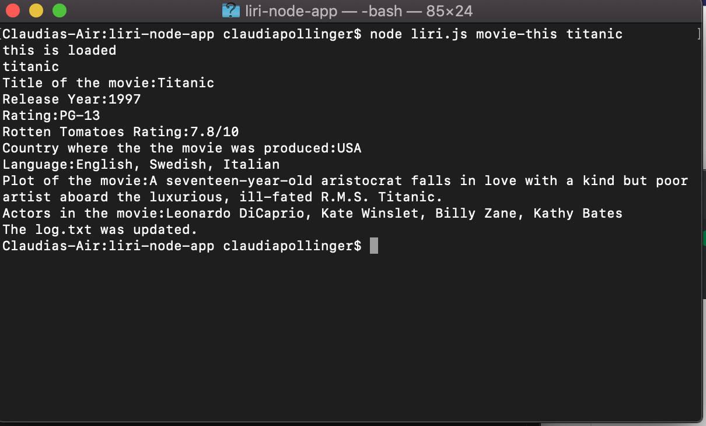

# liri-node-app

The liri-node app is an JavaScript Node Application that can perform four different functions on the back-end, which means we do not need the brownser to run JavaScript. The Liri can perform four functions including:
1. concert-this
2. spotify-this-song
3. movie-this
4. do-what-it-says

*Before using any of these functions the user would need to install in there bash/terminal: axios, moment, spotify, and require.

The Application allows the user to use one of these functions one at a time to for example "movie-this". 

First, the user would go into there bash/terminal and run one of the node functions by typing in node movie-this _________(whatever movie you choose). Then run the function. 

Below is a screenshot of the output for the example of Titanic. The user is able to get
* Title of the movie
* Release Year 
* Rating
* Rotten Tomatoes Rating 
* Country where the movie was produced
* The languages is avaible in 
* Plot of the movie

--Then updates that search to the log.txt file.-- 

