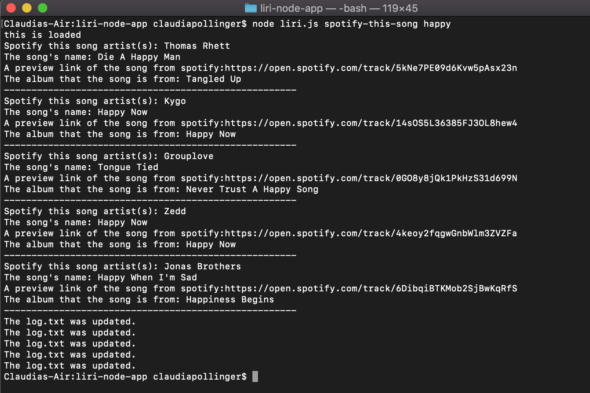

# liri-node-app

The liri-node app is an JavaScript Node Application that can perform four different functions on the back-end, which means we do not need the brownser to run JavaScript. The Liri can perform four functions including:
1. concert-this
2. spotify-this-song
3. movie-this
4. do-what-it-says

*Before using any of these functions the user would need to install in there bash/terminal: axios, moment, spotify, and require.

The Application allows the user to use one of these functions one at a time.  For example;"movie-this". 

First, the user would go into there bash/terminal and run one of the node functions by typing in node movie-this _________(whatever movie you choose). Then run the function. The output results include:

* Title of the movie
* Release Year 
* Rating
* Rotten Tomatoes Rating 
* Country where the movie was produced
* The languages is avaible in 
* Plot of the movie

--Then updates that search to the log.txt file.-- 

Below is a screenshot of the output for the example of the movie Titanic. 

In the spotify-this-song function, the user is able to search for any song. In return will get output fields including:
* Artist(s)
* The song's name 
* A preview link of the song from Spotify
* The album that the song is from 
* If there is no song the progema will default to "The Sign" by Ace of Base. 

--Then updates that search to the log.txt file.-- 

Below is a screenshot of the output for the example of the song happy. 

In the concert-this function, the user is able to search for any artist. In reture will get the output if the artist is on tour and will return including:
* Name of the venue
* Venue location
* Date of the Event (use moment to format this as "MM/DD/YYYY")

--Then updates that search to the log.txt file.-- 

Below is a screenshot of the output for the example of the artist Ariana Grande. 

In the do-what-it-says function, LIRI will take the text inside of random.txt and then use it to call one of Liri's Commands. 

Below is a screenshot of the output for the example of do-what-it-says

 TECHnologies used in the application: 

* [Node-Spotify-API](https://www.npmjs.com/package/node-spotify-api)

* [Axios](https://www.npmjs.com/package/axios)

* OMDB API](http://www.omdbapi.com) and the [Bands In Town API](http://www.artists.bandsintown.com/bandsintown-api)

* [Moment](https://www.npmjs.com/package/moment)

* [DotEnv](https://www.npmjs.com/package/dotenv)

* AJAX

* JavaScipt 

* JavaScript Node 

   